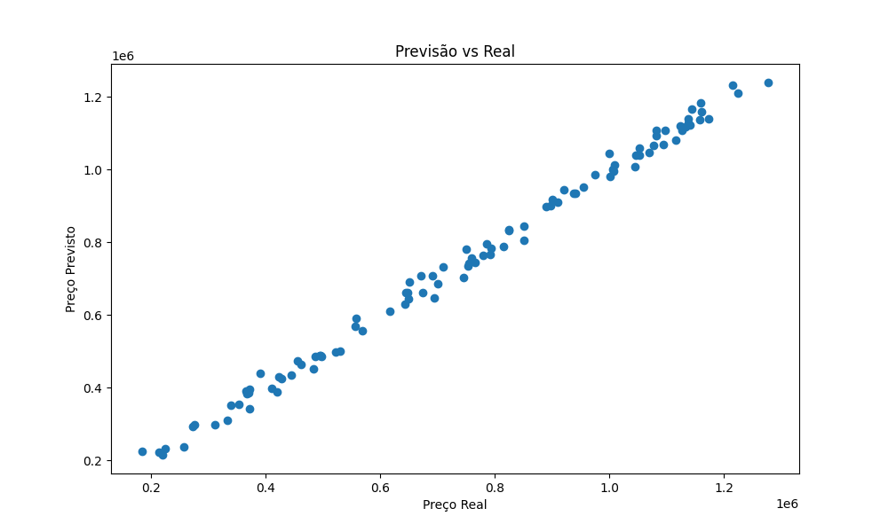
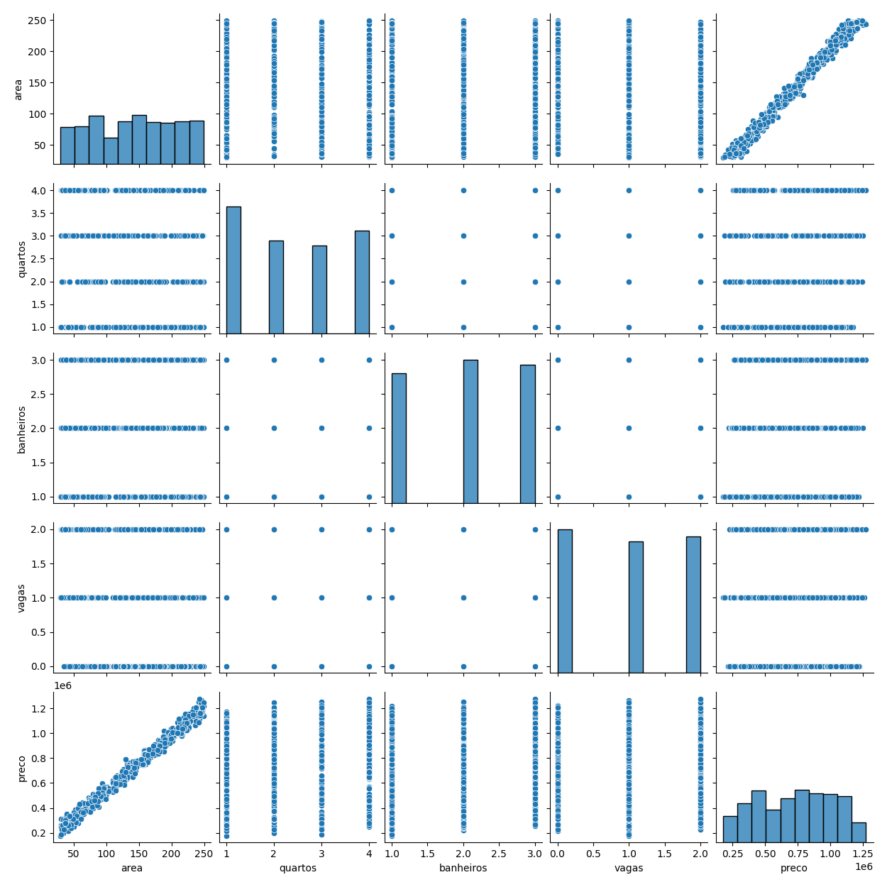

markdown
CopiarEditar
# Previsão de Preço de Imóveis 🏠

Este projeto realiza previsão de preços de imóveis utilizando regressão linear com Scikit-learn.

## 🔧 Ferramentas
- Python
- Pandas, Matplotlib, Seaborn
- Scikit-learn
- Streamlit (opcional)

## 📈 Resultados
- R²: 0.84
- MSE: 25849300.25

## 📊 Visualizações

## 🚀 Acesse o App
👉 [Demo interativo no Streamlit](https://link_para_streamlit)

## 📁 Notebook
📘 [Ver no nbviewer](https://nbviewer.org/github/usuario/repositorio/blob/main/notebook/previsao_preco.ipynb)
